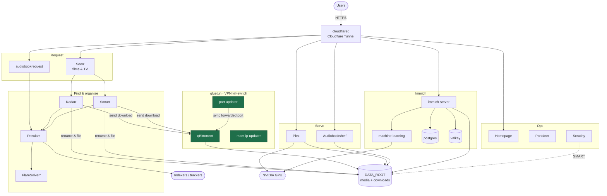

# secure-stream-stack

A self-hosted media, photo and audiobook server in one Docker Compose file.
Downloads run through a VPN kill-switch, Plex transcodes on an NVIDIA GPU, and
every container has a memory limit so one runaway service can't take the box down.

Built for a small home server (8 GB RAM, 4 cores, GTX 1060). Scales up fine — see
[Memory management](#memory-management).

---

## How it fits together



**The important boundary is `gluetun`.** qBittorrent, the port-updater and the
IP updater have no network stack of their own — they share the VPN container's.
If the tunnel drops, they lose internet entirely rather than falling back to
your real connection.

Everything else reaches the internet normally. Note that Prowlarr talks to
indexers directly, *not* through the VPN.

---

## What's in it

**Downloading** — everything here shares the VPN's network. If the tunnel drops, they lose internet.

| Service | What it does |
| :-- | :-- |
| `vpn` (gluetun) | VPN tunnel + kill-switch. All download traffic goes through it. |
| `torrent` (qBittorrent) | The torrent client. No direct internet access. |
| `port-updater` | Keeps qBittorrent's listen port matched to the VPN's forwarded port. |
| `mam-ip-updater` | Reports the VPN's current IP to a private tracker. |

**Finding & organising**

| Service | What it does |
| :-- | :-- |
| `prowlarr` | Indexer manager. One place to configure trackers; syncs them to Radarr/Sonarr. |
| `flaresolverr` | Solves Cloudflare challenges for indexers that need it. |
| `radarr` | Watches for movies, sends them to the downloader, renames and files them. |
| `sonarr` | Same, for TV series. |
| `overseerr` (Seerr) | Request page — users ask for a film or show without touching the backend apps. Runs [Seerr](https://docs.seerr.dev), the merged successor to Overseerr/Jellyseerr. |

**Watching & listening**

| Service | What it does |
| :-- | :-- |
| `plex` | Media server. Uses the GPU to transcode so the CPU stays free. |
| `audiobookshelf` | Audiobook and podcast server with progress sync. |
| `audiobookrequest` | Request page for audiobooks. |

**Photos** — Immich is four containers that work as one app.

| Service | What it does |
| :-- | :-- |
| `immich-server` | Photo library: upload, browse, share. |
| `immich-machine-learning` | Face and object recognition. Uses the GPU. |
| `immich-database` | Postgres with vector search for "find similar photos". |
| `immich-redis` | Job queue. |

**Getting in from outside**

| Service | What it does |
| :-- | :-- |
| `nginx-proxy-manager` | Reverse proxy + automatic HTTPS certificates. |
| `cloudflared` | Cloudflare tunnel — exposes services without opening router ports. |

**Keeping an eye on things**

| Service | What it does |
| :-- | :-- |
| `homepage` | Dashboard linking everything together. |
| `portainer` | Web UI for managing the containers. |
| `scrutiny` | Hard drive SMART health monitoring. |
| `excalidraw` | Self-hosted whiteboard. |

---

## Quick start

```bash
git clone https://github.com/Edems10/secure-stream-stack.git
cd secure-stream-stack

cp .env.example .env
chmod 600 .env
nano .env                 # fill in paths, VPN credentials, passwords

docker compose config -q  # validate before starting
docker compose up -d
```

`compose.yml` contains no secrets — everything comes from `.env`, which is
gitignored. Variables use `${VAR:?no .env}`, so if `.env` is missing Compose
fails immediately instead of silently starting with blank passwords.

### Prerequisites

**Docker**

```bash
curl -fsSL https://get.docker.com | sudo sh
```

**NVIDIA GPU** (optional — needed for Plex transcoding and Immich ML)

```bash
sudo apt install nvidia-driver-580
sudo apt install -y nvidia-container-toolkit
sudo nvidia-ctk runtime configure --runtime=docker
sudo systemctl restart docker
```

> **Keep the driver and kernel in step.** The NVIDIA kernel module must match the
> running kernel. If your kernel upgrades and no matching
> `linux-modules-nvidia-<version>-<kernel>` package is installed, the GPU
> disappears on the next reboot. Before rebooting after a kernel upgrade:
> ```bash
> NEW=$(ls -1 /boot/vmlinuz-* | sed 's|.*vmlinuz-||' | sort -V | tail -1)
> dpkg -l "linux-modules-nvidia-580-$NEW" | grep -q '^ii' && echo OK || echo "STOP — no module for $NEW"
> ```

**No GPU?** Remove `runtime: nvidia` and the `NVIDIA_*` environment lines from
`plex`, and delete the `immich-machine-learning` service.

---

## Configuration

Everything is in `.env`. The ones that matter most:

| Variable | What it is |
| :-- | :-- |
| `PUID` / `PGID` | The user that owns your media files. Run `id` to find yours. |
| `TZ` | Timezone. Used by every container, so logs and schedules agree. |
| `CONFIG_ROOT` | Where app configs live. Put this on an SSD. |
| `DATA_ROOT` | Where media and downloads live. Usually a big disk or array. |
| `OPENVPN_USER` / `OPENVPN_PASSWORD` | VPN credentials. |
| `VPN_SERVER_REGIONS` | Which VPN region to connect to. |
| `QBITTORRENT_USER` / `QBITTORRENT_PASS` | Must match qBittorrent's own WebUI login. |
| `PLEX_CLAIM` | One-time token from [plex.tv/claim](https://plex.tv/claim). Expires in 4 minutes. |
| `IMMICH_DB_PASSWORD` | Immich's database password. Set before first start. |

---

## Memory management

This stack runs on an 8 GB machine. Without limits, a single container having a
bad day — a big Immich library scan, a huge torrent recheck — can consume all
the RAM and livelock the whole server. Every service therefore sets three things:

| Setting | Meaning |
| :-- | :-- |
| `mem_limit` | Hard cap. The container is killed if it exceeds this, instead of dragging the host down. |
| `mem_reservation` | Soft floor. Under pressure the kernel reclaims memory from containers that are above their reservation first. |
| `oom_score_adj` | Who dies first. Negative = protected. Positive = kill me first. |

The priorities here are: **downloading and media playback are protected; photos are
expendable.** Immich is set to be killed first, because a failed library scan is an
inconvenience while a frozen server is a weekend.

```
oom_score_adj  -500   downloading (vpn, torrent, audiobooks)
               -400   plex, radarr, sonarr, prowlarr
               -300   ingress (proxy, cloudflared)
               +100   dashboards, portainer
               +600   immich database, redis
               +900   immich machine learning   <- first to go
```

### Does it fit?

Limits add up to **10.6 GiB**, which is more than the machine has — that's fine,
because limits are caps that are never all hit at once. The number that must fit
is the **reservations: 4.0 GiB**, against roughly 4.9 GiB free after the OS and
filesystem cache.

### Running this with more RAM

Scale the reservations to fit. The rule:

```
available for containers  =  total RAM  -  1 GB (OS)  -  filesystem cache/ZFS ARC
keep the sum of mem_reservation below that number
```

| Your RAM | Suggested approach |
| :-- | :-- |
| 8 GB | Use the values as shipped. |
| 16 GB | Double `mem_limit` on `immich-server`, `immich-machine-learning`, `plex` and `torrent`. Leave the rest. |
| 32 GB+ | Raise limits generously, or delete the `mem_limit` lines entirely and rely on `oom_score_adj` for priority. |

To change one service:

```yaml
  immich-server:
    mem_limit: 2g          # was 1g
    mem_reservation: 512m  # was 256m
```

Then `docker compose up -d immich-server`.

Check whether anything is actually being killed:

```bash
docker stats --no-stream
for c in $(docker ps -aq); do
  docker inspect -f '{{.Name}} oom={{.State.OOMKilled}} restarts={{.RestartCount}}' $c
done | grep -v 'oom=false restarts=0'
```

Anything listed is hitting its cap and needs more.

### If you use ZFS

ZFS's ARC cache defaults to **half your RAM** and competes directly with these
containers. On a small box, cap it:

```bash
echo 'options zfs zfs_arc_max=2147483648' | sudo tee /etc/modprobe.d/zfs.conf  # 2 GiB
sudo update-initramfs -u -k all
echo 2147483648 | sudo tee /sys/module/zfs/parameters/zfs_arc_max              # apply now
```

### Worth installing either way

`earlyoom` kills a single process when memory runs low, instead of letting the
kernel livelock — which is a far better failure mode than an unresponsive server.

```bash
sudo apt install -y earlyoom
sudo systemctl enable --now earlyoom
```

---

## Ports

| Service | URL |
| :-- | :-- |
| Homepage | `http://IP:3000` |
| Plex | `http://IP:32400/web` |
| Seerr (requests) | `http://IP:5055` |
| Immich | `http://IP:2283` |
| Audiobookshelf | `http://IP:13378` |
| Audiobook requests | `http://IP:8001` |
| qBittorrent | `http://IP:8080` |
| Sonarr | `http://IP:8989` |
| Radarr | `http://IP:7878` |
| Prowlarr | `http://IP:9696` |
| Scrutiny | `http://IP:8085` |
| Excalidraw | `http://IP:5051` |
| Portainer | `https://IP:9443` |
| Nginx Proxy Manager | `http://IP:81` |

---

## Troubleshooting

**Compose fails with `no .env`** — you haven't created `.env`. Copy `.env.example`.

**qBittorrent has no internet** — that's the kill-switch working. Check the VPN:
`docker logs gluetun`.

**Plex isn't using the GPU** — hardware transcoding needs an active **Plex Pass**,
and must be enabled in *Settings → Transcoder → Use hardware acceleration*.
Confirm with `nvidia-smi` during playback; you should see a `Plex Transcoder`
process and a non-zero encoder session.

**A container keeps restarting** — check whether it's running out of memory:
`docker inspect <name> --format '{{.State.OOMKilled}}'`.

---

## Legal

This project is for managing **media you own** and for sharing **open-source
software** over BitTorrent. The authors do not condone downloading or
distributing copyrighted material without permission. You are responsible for
complying with the laws where you live.
